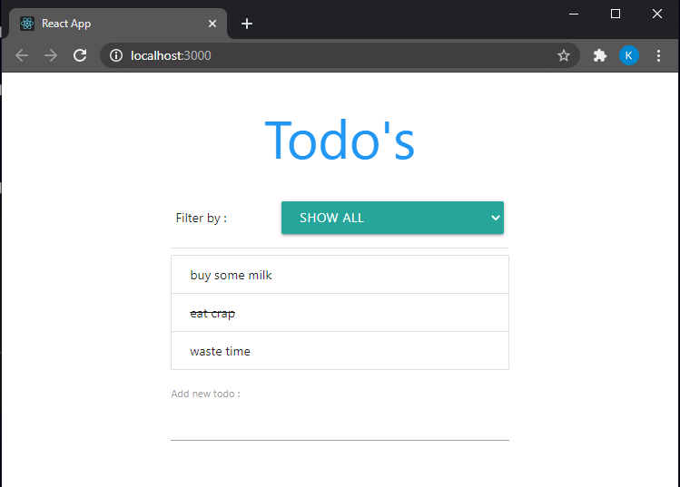

 

  

  <h3 align="center">Todo's App</h3>
 
  

## Preview
 

_Todo's can be added, marked completed, marked pending. Todo's can be duplicated or deleted._

 
<table>
<tr>
<td> 

</td>

<td>

* Displaying all the todos.
  

</td>
</tr>
<tr>

<td>

* Displaying completed todo's.

</td>
<td> 

</td>

</tr>
<tr>
<td> 

</td>

<td>

* Displaying pending todo's

</td>
</tr>
</table>

   

