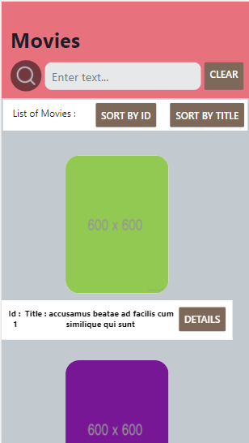
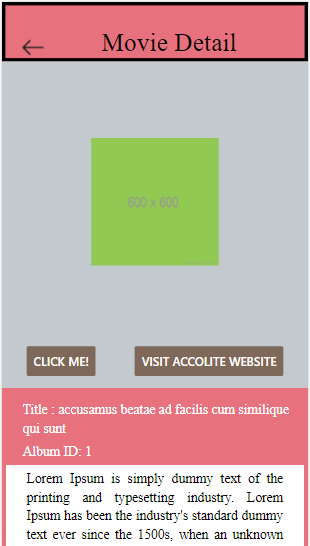

 

  

  <h3 align="center">React Native App</h3>
 
  

## Milestone 1
 
<table>
<tr>
<td> 

</td>

<td>

* List can be filtered on the basis of the text written in search box.
  
* List can be sorted based on ID or title with the respective buttons.
  
* Clear button can be to clear out the text entered in the search input box and remove filtering.

</td>
</tr>
</table>

   

## Milestone 2

<table>
<tr>
<td> 

* Back arrow button can be used to move back to the homepage.
  
* On pressing 'Click Me' button, displays an alert box.
  
* On clicking the 'View Details' button, [Accolite](https://www.accolite.com/) website is opened in a webview.

</td>
<td>

</td>
</tr>
</table>

